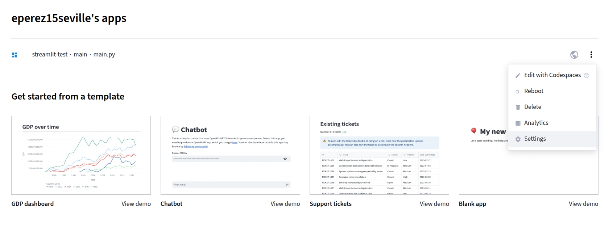
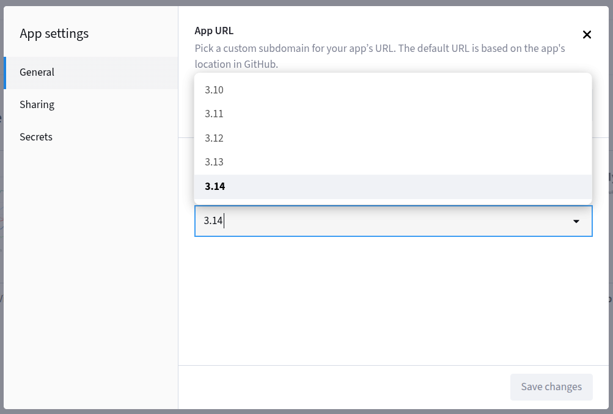
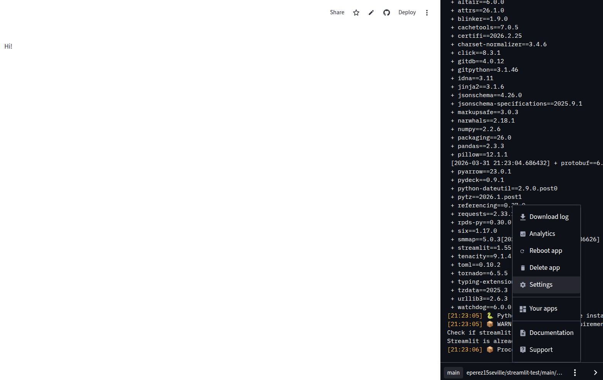

# Create basic application

Go to https://docs.streamlit.io/get-started/tutorials/create-an-app.

# Export Libraries to Streamlit format

```
uv export --format requirements-txt > requirements.txt
```

# Run in Cloud

Go to https://docs.streamlit.io/deploy/streamlit-community-cloud/get-started/create-your-account. It should be the same account as Github.

# Customize your app

1. Change the Python version.







# Documentation about Streamlit

Go to https://docs.streamlit.io/develop/api-reference.

# App available at

https://app-test-uah9aan2p3swbfdavboeyt.streamlit.app/